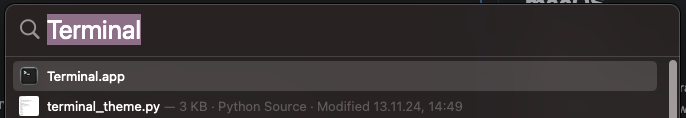

Um Java Programme schreiben zu können brauchen wir einen Editor und zum Ausführen einen Compiler. Das Programm **Intellij IDEA** kombiniert diese Funktionen. Deshalb benutzen wir dieses Program um mit Java zu programmieren.

## macOS

{: .widget .info }
Ihr müsst die folgenden Schritte nicht machen, wenn ihr die Schul PCs benutzt, da dort IntelliJ schon installiert ist

### Installation

Um IntelliJ zu installieren brauchen wir Jetbrains Toolbox. <br>
Zum Installieren benutzen wird das Terminal. <br> 
Dies kannst du öffnen, indem du `cmd` + `Leertaste` gleichzeitig drückst und `Terminal` suchst.



Im Terminal Copy-und-pastes du diesen Command hier:
```sh
bash <(curl -s https://lg-ks-programmierag.github.io/java/programmierumgebung/install-jetbrains.sh)
```


