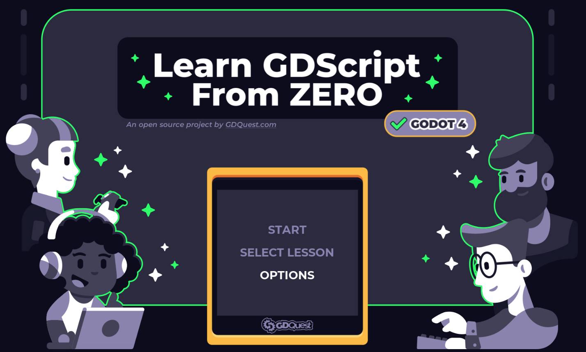

## Was ist Godot?

Godot ist eine **kostenlose Game-Engine**, mit der man eigene Computerspiele erstellen kann. Es funktioniert für **2D- und 3D-Spiele** und bietet eine einfache **Programmiersprache namens GDScript**.

## Warum Godot?

- **Kostenlos und Open Source**  
- **Leicht zu lernen**  
- **Gut für 2D- und 3D-Spiele**  

## Was kann man mit Godot machen?

Mit Godot kannst du z. B.:  
- ein Jump’n’Run-Spiel bauen 🎮  
- ein Rennspiel erstellen 🚗  
- ein Rätsel-Abenteuer entwickeln 🔍  

## Installation

1. **Godot herunterladen** von [godotengine.org](https://godotengine.org/)
2. **Ein erstes Projekt starten**  
3. **GDScript lernen** und dein Spiel programmieren  

## Nächste Schritte

Als Nächstes solltest du **GDScript** lernen. **GDScript** ist die eigene Programmiersprache von **GODOT**. Mit ihr wirst du später deine Spiele erstellen.

Auf der Website von [GD-Quest](https://gdquest.github.io/learn-gdscript/) kannst du in einem interaktiven Kurs die Sprache **GDScript** erlernen. Um auf die Website zu kommen klick einfach [hier!](https://gdquest.github.io/learn-gdscript/)

Du kannst dich auf den nächsten Seiten auch erst einmal mit der Benutzeroberfläche von **GODOT** vertraut machen. Sobald du beides getan hast, kannst du deine ersten Projekte erstellen.

{: .widget .info }
Wenn du irgendetwas bestimmtes zu **Godot** wissen willst, dann schau in die offizielle Dokumentation. Dort findest du alles wichtige zu allen möglchen Befehlen. https://docs.godotengine.org/de/4.x/