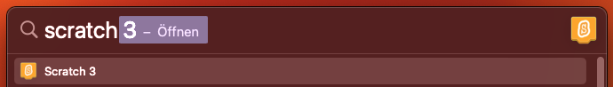
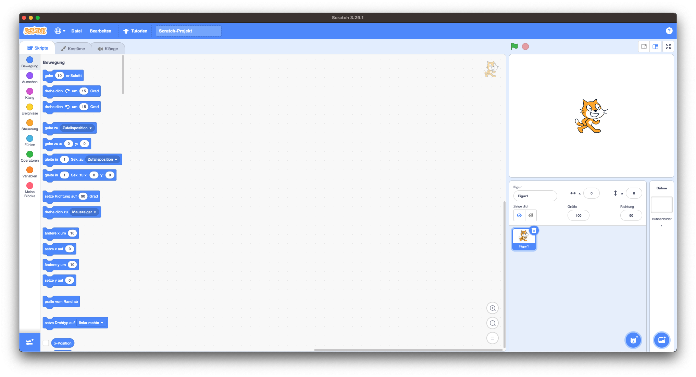

In dieser Dokumebntation lernst du deine erste Programmiersprache: **Scratch!**

Spiele in Scratch kannst du sehr einfach erstellen, da du einfach Anweisungen grafisch miteinander verbinden kannst anstatt Code schreiben zu müssen. So kannst du nicht so einfach Fehler machen und den Code wird meist sofort so funktionieren, wie du es willst.

## Scratch öffnen

Um mit Scratch zu programmieren musst du es zunächst einmal öffnen. Das kannst du auf den Macs in der Schule ganz einfach über die *Spotlight search* machen. Diese öffnest du mit `cmd` + `Leertaste`.

{: .widget .info }
Wenn du auf einen anderen Computer Scratch benutzen willst, kannst du es einfach im *Web-Browser* unter [scratch.mit.edu](https://scratch.mit.edu).

## Benutzeroberfläche

Hier siehtst du, die **Benutzeroberfläche von Scratch**. Der große Bereich in der Mitte ist der **Codebereich**, in welchem du dein Spiel programmierst. Links davon findest du alle verfügbaren Codeblöcke. Auf der Rechten Seite siehst du oben das **Spielfenster**, in welchem später alles, was du programmierst geschehen wird. Darunter findest du noch die **Figur-/Hintergrund-Übersicht**. Hier kannst du neue Figuren und Hintergründe hinzufügen, aber auch bestehende modifizieren und löschen.